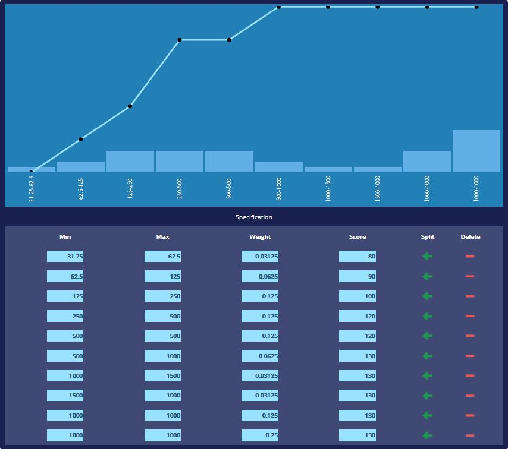

# react-distribution-plot

> Distribution plot component

[](https://www.npmjs.com/package/react-distribution-plot) [](https://standardjs.com)



## Install

```bash
npm install --save react-distribution-plot
```

## Usage

```jsx
import React, { Component } from 'react'

import DistributionPlotComponent from 'react-distribution-plot'
import 'react-distribution-plot/dist/index.css'

class Example extends Component {
  render() {
    return <DistributionPlotComponent bins={[[0, 1, 1, 0]]} categorical={false} width={800}/>
  }
}
```

## License

MIT © [pamiro](https://github.com/pamiro)
